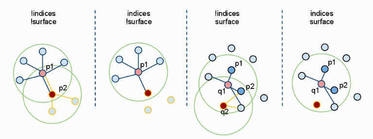
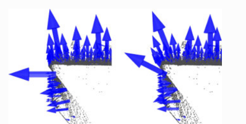
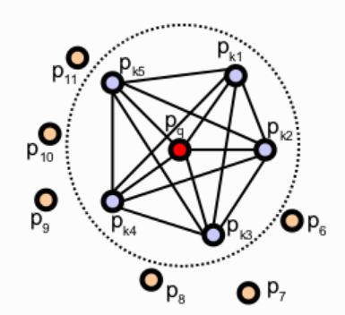
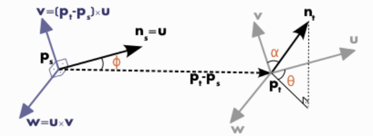
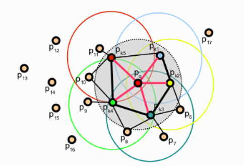
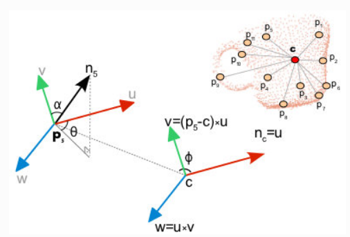
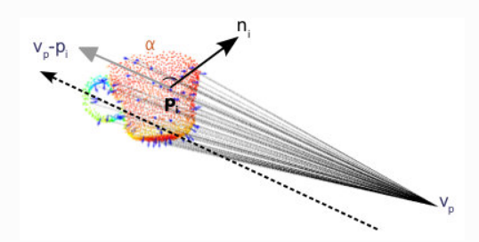
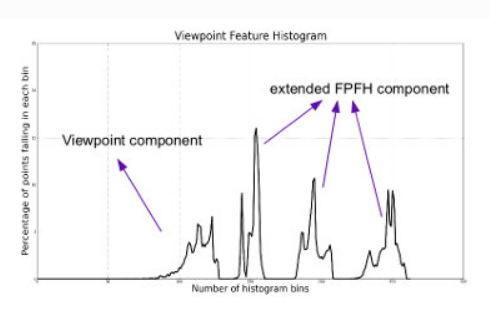

# PCL_Learning

个人学习 PCL (Point Cloud Library) 的仓库.


## Install Note

-   安装配置
    -   Ubuntu 18.04
    -   GPU RTX 3060 + CUDA 11.1
    -   PCL 1.9.1 + VTK 8.2.0


-   主要参考 PCL [安装教程](https://blog.csdn.net/qq_42257666/article/details/124574029)

-   安装依赖

    ```bash
    sudo apt-get update  
    sudo apt-get install git build-essential linux-libc-dev
    sudo apt-get install cmake cmake-gui
    sudo apt-get install libusb-1.0-0-dev libusb-dev libudev-dev
    sudo apt-get install mpi-default-dev openmpi-bin openmpi-common
    sudo apt-get install libflann1.9 libflann-dev
    sudo apt-get install libeigen3-dev 
    sudo apt-get install libboost-all-dev
    sudo apt-get install libvtk7.1-qt
    sudo apt-get install libvtk7.1
    sudo apt-get install libvtk7-qt-dev
    sudo apt-get install libqhull* libgtest-dev
    sudo apt-get install freeglut3-dev pkg-config
    sudo apt-get install libxmu-dev libxi-dev
    sudo apt-get install mono-complete
    sudo apt-get install openjdk-8-jdk openjdk-8-jre
    ```

-   安装 VTK

    -   安装依赖

    ```bash
    sudo apt-get install cmake-curses-gui
    sudo apt-get install freeglut3-dev
    ```

    -   安装 [VTK-8.2.0](https://vtk.org/download/) 
        -   mkdir build
        -   通过 cmake-gui 配置依赖
        -   选择source 和 build 路径
        -   勾选grouped advanced
        -   点击configuration 
        -   红色区域中勾选 Module_vtkGUISupportQt、VTK_Group_Qt
        -   重新 configure, generate
        -   如果有问题就删除build内容, 重新configure generate
        -   sudo make
        -   sudo make install

    

-   编译 PCL

    ```bash
    $ mkdir -p build/installed
    $ cd build
    
    $ cmake \
    > -DCMAKE_BUILD_TYPE=None \
    > -DCMAKE_INSTALL_PREFIX=./installed \
    > -DBUILD_GPU=ON \
    > -DBUILD_apps=ON \
    > -DBUILD_examples=ON \
    > ..   
    ```

    

    -   `Error generating file pcl_gpu_octree_generated_knn_search.cu.o`

        -   sm_30 sm_70 及以上不支持, 删掉 `cmake/pcl_find_cuda.cmake` 中sm_30, sm_70 及以上

            ```cmake
            if(NOT ${CUDA_VERSION_STRING} VERSION_LESS "10.0")
            	# set(__cuda_arch_bin "3.0 3.5 5.0 5.2 5.3 6.0 6.1 7.0 7.2 7.5")
            	set(__cuda_arch_bin "3.5 5.0 5.2 5.3 6.0 6.1")
            ```

            

    -   `No CMAKE_CUDA_COMPILER could be found`

        -   `.zshrc` 中添加 `export PATH=$PATH:/usr/local/cuda-11.1/bin/`


# PCL Official Tutorial

[PCL Official Tutorial](https://pcl.readthedocs.io/projects/tutorials/en/master/)


## Basic Usage

### PCL Walkthrough

PCL 点云库包括以下模块:

-   Filters
    -   点云滤波, 如降采样, 过滤噪音离群点等
-   Features
    -   点云特征, 比如局部点云的法线, 弯曲度等
-   Keypoints
    -   点云关键点
-   Registration
    -   点云配准
-   KdTree
    -   Kd树
-   Octree
    -   八叉树
-   Segmentation
    -   点云分割
-   Sample Consensus
    -   样本一致性 如[RANSAC](https://zhuanlan.zhihu.com/p/402727549) 
-   Surface
    -   点云表面重建
-   Range Image
    -   深度图
-   IO
    -   点云输入输出, 如读写PCD
-   Visualization
    -   点云可视化
-   Common
    -   PCL的通用模块
-   Search
    -   点云搜索库
-   Binaries
    -   常用的PCL工具, 如pcl_viewer

### Getting Started / Basic Structures

-   PointCloud 
    -   organized point cloud 
        -   表示像图片一样分为行列的点数据
    -   projectable point cloud
        -   可以通过相机模型转换为图像UV坐标
        -   $u = fx/z, v = fy/z$
    -   `width (int)`
        -   可以指代 organized point cloud 的一行点数量, 即宽度
        -   可以指代 unorganized point cloud 的点总数
    -   `height (int)`
        -   可以指代 organized point cloud 的一列点数量, 即高度
        -   unorganized point cloud 时设置为1
    -   `points (std::vector<PointT>)`
        -   保存点云中所有的点
    -   `is_dense (bool)`
        -   表示所有点的数据都是有限的, finit (true),  Inf/NaN (fasle)
    -   `sensor_origin_ (Eigen::Vector4f)`
        -   点云传感器位姿 translation
    -   `sensor_orientation_ (Eigen::Quaternionf)`
        -   点云传感器位姿 orientation
    -   `is_Organized()`
        -   判断是否是 organized point cloud


### Using PCL in your own project

-   CMakeLists.txt 指定 PCL 安装位置

    ```cmake
    find_package(PCL 1.9.1 REQUIRED COMPONENTS common io
        PATHS "/home/shan/App/pcl/pcl-pcl-1.9.1/build/installed"
        NO_DEFAULT_PATH
    )
    ```

-   `error while loading shared libraries: libvtkCommonMisc-8.2.so.1`

    ```bash
    # 方法1: 将 /usr/local/lib 加入到 /etc/ld.so.conf, 然后执行ldconfig
    sudo chmod 777 /etc/ld.so.conf
    sudo echo "/usr/local/lib" >> /etc/ld.so.conf
    sudo ldconfig
    
    # 方法2: 临时添加到 LD_LIBRARY_PATH, 在 .zshrc 中添加以下内容
    export LD_LIBRARY_PATH=/usr/local/lib:$LD_LIBRARY_PATH
    
    ```

-   example: `write_pcd.cpp`

### Using a matrix to transform a point cloud

-   example: `matrix_transform.cpp`

-   转换一个点或一个向量

    ```bash
    # 点 添加1在末尾
    [10, 5, 0,  1] * 4x4_transformation_matrix
    # 向量 添加0在末尾
    [3,  0, -1, 0] * 4x4_transformation_matrix
    ```

    

## Advanced Usage

### Adding your own custom PointT type

#### PointT types available in PCL

-   PointXYZ, 

    -   member: float x, y, z

    -   通过联合体实现 SSE alignment (数据地址对齐)

    -   ```
        union
        {
          float data[4];
          struct
          {
            float x;
            float y;
            float z;
          };
        };
        ```

        

-   PointXYZI

    -   member: float x, y, z, intensity

    -   单独设置一个联合体用于Intensity, 因为xyz的联合体最后一项data[3]会被设置为0/1用于transformation

    -   ```
        union
        {
          float data[4];
          struct
          {
            float x;
            float y;
            float z;
          };
        };
        union
        {
          struct
          {
            float intensity;
          };
          float data_c[4];
        };
        ```

        

-   PointXYZRGBA

    -   member: float x, y, z; std::uint32_t rgba

    -   ```
        union
        {
          float data[4];
          struct
          {
            float x;
            float y;
            float z;
          };
        };
        union
        {
          union
          {
            struct
            {
              std::uint8_t b;
              std::uint8_t g;
              std::uint8_t r;
              std::uint8_t a;
            };
            float rgb;
          };
          std::uint32_t rgba;
        };
        ```

-   PointXYZRGB

    -   same as PointXYZRGBA
    -   member: float x, y, z; std::uint32_t rgba

-   PointXY

    -   member: float x, y

    -   ```
        struct
        {
          float x;
          float y;
        };
        ```

-   InterestPoint

    -   member:  float x, y, z, strength

    -   ```
        union
        {
          float data[4];
          struct
          {
            float x;
            float y;
            float z;
          };
        };
        union
        {
          struct
          {
            float strength;
          };
          float data_c[4];
        };
        ```

-   Normal

    -   member: float normal[3], curvature

    -   ```
        union
        {
          float data_n[4];
          float normal[3];
          struct
          {
            float normal_x;
            float normal_y;
            float normal_z;
          };
        }
        union
        {
          struct
          {
            float curvature;
          };
          float data_c[4];
        };
        ```

-   PointNormal

    -   member:  float x, y, z; float normal[3], curvature

    -   ```
        union
        {
          float data[4];
          struct
          {
            float x;
            float y;
            float z;
          };
        };
        union
        {
          float data_n[4];
          float normal[3];
          struct
          {
            float normal_x;
            float normal_y;
            float normal_z;
          };
        };
        union
        {
          struct
          {
            float curvature;
          };
          float data_c[4];
        };
        ```

-   PointXYZRGBNormal

    -   member: float x, y, z, normal[3], curvature; std::uint32_t rgba

    -   ```
        union
        {
          float data[4];
          struct
          {
            float x;
            float y;
            float z;
          };
        };
        union
        {
          float data_n[4];
          float normal[3];
          struct
          {
            float normal_x;
            float normal_y;
            float normal_z;
          };
        }
        union
        {
          struct
          {
            union
            {
              union
              {
                struct
                {
                  std::uint8_t b;
                  std::uint8_t g;
                  std::uint8_t r;
                  std::uint8_t a;
                };
                float rgb;
              };
              std::uint32_t rgba;
            };
            float curvature;
          };
          float data_c[4];
        };
        ```

-   PointXYZINormal

    -   member: float x, y, z, intensity, normal[3], curvature

    -   ```
        union
        {
          float data[4];
          struct
          {
            float x;
            float y;
            float z;
          };
        };
        union
        {
          float data_n[4];
          float normal[3];
          struct
          {
            float normal_x;
            float normal_y;
            float normal_z;
          };
        }
        union
        {
          struct
          {
            float intensity;
            float curvature;
          };
          float data_c[4];
        };
        ```

-   PointWithRange (depth map)

    -   member: float x, y, z (union with float point[4]), range

    -   ```
        union
        {
          float data[4];
          struct
          {
            float x;
            float y;
            float z;
          };
        };
        union
        {
          struct
          {
            float range;
          };
          float data_c[4];
        };
        ```

-   PointWithViewpoint

    -   member: float x, y, z, vp_x, vp_y, vp_z

    -   ```
        union
        {
          float data[4];
          struct
          {
            float x;
            float y;
            float z;
          };
        };
        union
        {
          struct
          {
            float vp_x;
            float vp_y;
            float vp_z;
          };
          float data_c[4];
        };
        ```

-   MomentInvariants

    -   member: float j1, j2, j3

    -   Simple point type holding the 3 moment invariants at a surface patch

    -   ```
        struct
        {
          float j1, j2, j3;
        };
        ```

-   PrincipalRadiiRSD

    -   member: float r_min, r_max

    -   Simple point type holding the 2 RSD radii at a surface patch

    -   ```
        struct
        {
          float r_min, r_max;
        };
        ```

-   Boundary

    -   member: std::uint8_t boundary_point

    -   Simple point type holding whether the point is lying on a surface boundary or not

    -   ```
        struct
        {
          std::uint8_t boundary_point;
        };
        ```

-   PrincipalCurvatures

    -   member: float principal_curvature[3], pc1, pc2
    -   Simple point type holding the principal curvatures of a given point.

-   PFHSignature125

    -   member: float pfh[125]
    -   Simple point type holding the PFH (Point Feature Histogram) of a given point. 

-   FPFHSignature33

    -   member: float fpfh[33]
    -   Simple point type holding the FPFH (Fast Point Feature Histogram) of a given point.

-   VFHSignature308

    -   member: float vfh[308]
    -   Simple point type holding the VFH (Viewpoint Feature Histogram) of a given point.

-   Narf36

    -   member: float x, y, z, roll, pitch, yaw; float descriptor[36]
    -   Simple point type holding the NARF (Normally Aligned Radius Feature) of a given point.

-   BorderDescription

    -   member: int x, y; BorderTraits traits
    -   Simple point type holding the border type of a given point.

-   IntensityGradient

    -   member: float gradient[3]
    -   Simple point type holding the intensity gradient of a given point.

-   Histogram

    -   member: float histogram[N]
    -   General purpose n-D histogram placeholder

-   PointWithScale

    -   member: float x, y, z, scale
    -   Similar to PointXYZI

-   PointSurfel

    -   member: float x, y, z, normal[3], rgba, radius, confidence, curvature


#### Add new PointT type

example: 02-advanced_usage/01_adding/custom_ptype.cpp


### Writing a new PCL class

example: 

-   pcl/filters/include/pcl/filters/bilateral.h
-   pcl/filters/include/pcl/filters/impl/bilateral.hpp
-   pcl/filters/src/bilateral.cpp


## Visualization

example

-   01_simple_pcd_viewer.cpp
    -   简单的 pcd viewer
-   02_multithread_pcd_viewer.cpp
    -   多线程的 pcd viewer
-   03_range_image_viewer.cpp
    -   点云转化为深度图, 并可视化点云和深度图
    -   效果与预期不符, 可能是视角的问题
-   04_pcl_visualizer.cpp
    -   实现给点云上色, 显示法线, 添加形状, 多视图, 键鼠交互等


## Feature

### How 3D Features work in PCL

-   just cartesian coordiantes is not enough
-   other characteristics and metrics
    -   intensity
    -   surface remission
    -   color
-   good point feature representation 好的点云特征
    -   rigid transformations
    -   varying sampling density
    -   noise

-   KD-树搜索 [KD-Tree](https://zhuanlan.zhihu.com/p/529487972)
    -   k-search
        -   k nearst neighbors 
    -   radius-search
        -   all neast neightnors in a sphere of radius r
    -   ranged k-search
        -   k nearst neighbors in a range


#### How to pass the input

-   setInputCloud (PointCloudConstPtr &)
    -   输入点云
-   setIndices (IndicesConstPtr &)
    -   输入索引, 用来指定需要操作的部分点云的索引
-   setSearchSurface (PointCloudConstPtr &)
    -   输入搜索范围, 用来作为Input点云的搜索面
    -   比如通过关键点去计算整个点云的特征
        -   原始点云通过 setSearchSurface() 输入
        -   关键点通过 setInputCloud() 输入




#### An example for normal estimation

-   example: 03_pcl_feature/01_normal_estimation.cpp


### Estimating Surface Normals in a PointCloud

-   example: 03_pcl_feature/01_normal_estimation.cpp

通过最小二乘的原理, 可以使用 PCA 来求解 covariance matrix 获得 eigen value 和 eigen vector 来求得法向量 normal, 选择最小特征值对应的特征向量，并进行单位归一化，则该向量为点云法向量

```cpp
// Placeholder for the 3x3 covariance matrix at each surface patch
Eigen::Matrix3f covariance_matrix;
// 16-bytes aligned placeholder for the XYZ centroid of a surface patch
Eigen::Vector4f xyz_centroid;

// Estimate the XYZ centroid
compute3DCentroid (cloud, xyz_centroid);

// Compute the 3x3 covariance matrix
computeCovarianceMatrix (cloud, xyz_centroid, covariance_matrix);
```

需要注意法向量的正反方向, 通过设置 viewpoint 可以统一法向量的方向

```cpp
flipNormalTowardsViewpoint (
    const PointT &point, float vp_x, float vp_y, float vp_z, Eigen::Vector4f &normal);
```

计算法向量时需要选择 k 个最近点 或 r 搜索半径, 这决定了法向量的计算结果, 下图左是较小的k/r, 右是太大的k/r



计算法向量的伪代码

```pseudocode
for each point p in cloud P

  1. get the nearest neighbors of p

  2. compute the surface normal n of p

  3. check if n is consistently oriented towards the viewpoint and flip otherwise
```

设置视角点

```cpp
setViewPoint (float vpx, float vpy, float vpz);
```

计算单个点的法向量

```cpp
computePointNormal (
    const pcl::PointCloud<PointInT> &cloud, 
    const std::vector<int> &indices, 
    Eigen::Vector4f &plane_parameters, 
    float &curvature);
```

使用 OpenMP 加速 normal estimation

-   pcl::NormalEstimationOMP


### Normal Estimation Using Integral Images

-   example: 03_pcl_feature/02_normal_estimation_using_integral_images.cpp


### Point Feature Histograms (PFH) descriptors

-   PFH 点特征直方图

    -   只有法线不足以表现点云的细节特征

    -   PFH 通过使用多维的直方图来生成某点周围的平均曲率来表现某点的K个邻点的几何关系

        

    -   对某点的K个邻点, 前提是他们的法向量已知, 我们需要两两计算两点以及他们的法线之间的差距, 首先在每两个点之间设定一个坐标系UVW

        
        $$
        \begin{aligned}
        \mathrm{\boldsymbol{u}} &=\boldsymbol{n}_s \\
        \mathrm{\boldsymbol{v}} &=\mathrm{\boldsymbol{u}} \times \frac{\left(\boldsymbol{p}_t-\boldsymbol{p}_s\right)}{\left\|\boldsymbol{p}_t-\boldsymbol{p}_s\right\|_2} \\
        \mathrm{\boldsymbol{w}} &=\mathrm{\boldsymbol{u}} \times \mathrm{\boldsymbol{v}}
        \end{aligned}
        $$
        
-   通过UVW计算两个点之间的四个特征 $(\alpha, \phi, \theta, d)$, 如此可将两个点的坐标与法线信息从(3+3)x2=12个减少到4个
        $$
        \begin{aligned}
        \alpha &=\mathbf{v} \cdot \boldsymbol{n}_t \\
        \phi &=\mathbf{u} \cdot \frac{\left(\boldsymbol{p}_t-\boldsymbol{p}_s\right)}{d} \\
        \theta &=\arctan \left(\mathbf{w} \cdot \boldsymbol{n}_t, \mathbf{u} \cdot \boldsymbol{n}_t\right) \\
        d &= \left\|\boldsymbol{p}_t-\boldsymbol{p}_s\right\|_2
        \end{aligned}
        $$
        
    -   单独计算两个点的PFH

        -   ```c++
        computePairFeatures (const Eigen::Vector4f &p1, const Eigen::Vector4f &n1,
                                 const Eigen::Vector4f &p2, const Eigen::Vector4f &n2,
                                 float &f1, float &f2, float &f3, float &f4);
            ```
    
            

    -   将以上计算的四种特征, 每种都分为b份, 并画成直方图, 就是PFH的完整表达

-   example:  03_pcl_feature/03_pfh_estimation.cpp

-   Pseudo code

    ```pseudocode
    for each point p in cloud P
      1. get the nearest neighbors of p
      2. for each pair of neighbors, compute the three angular values
      3. bin all the results in an output histogram
    ```

-   计算点云中单个点的PFH

    ```c++
    computePointPFHSignature (
        const pcl::PointCloud<PointInT> &cloud,
    	const pcl::PointCloud<PointNT> &normals,
    	const std::vector<int> &indices,
    	int nr_split,
    	Eigen::VectorXf &pfh_histogram);
    ```

-   计算PFH之前最好检查一下数据是否finit


### Fast Point Feature Histograms (FPFH) descriptors

-   传统PFH算法的时间复杂度 $O(nk^2)$, 非常耗时

-   FPFH 的时间复杂度为 $O(nk)$

    -   Step1: 计算点云中每个查询点 $p_q$ 与其K个邻点的 $\alpha, \phi, \theta$, 这步被称为 Simplified Point Feature Histogram (SPFH)

    -   Sept2: 对于每个点, 重新确定K个邻点, 使用相邻的 $p_q$ 的 SPFH值用来加权, 权重 $w_i$ 表示查询点 $p_q$ 与相邻点 $p_i$ 之间的某个度量距离
        $$
        F P F H\left(\boldsymbol{p}_q\right)=S P F H\left(\boldsymbol{p}_q\right)+\frac{1}{k} \sum_{i=1}^k \frac{1}{\omega_i} \cdot S P F H\left(\boldsymbol{p}_i\right)
        $$
        

-   FPFH vs PFH

    -   FPFH 没有完全覆盖PFH的数据
    -   FPFH 还包括一些在r范围外的数据
    -   FPFH 时间复杂度比 PFH 小很多, 可以实现实时应用

-   下图中红色线表示第一次 $p_q$ 与其邻点的SPFH值, 随后其邻点也同样进行该操作, 表示为图中的五个圈, 随后 $p_q$ 再一次计算与其邻点的SPFH值, 但这次要同样考虑其邻点的SPFH值, 

    

-   Pseudo Code

    ```pseudocode
    for each point p in cloud P
    	step 1:
    		1. get the nearest neighbors of p
    		2. for each pair of p, p_i (where p_i is a neighbor of p, compute the three angular values
    		3. bin all the results in an output SPFH histogram
    	step 2:
    		1. get the nearest neighbors of p
    		2. use each SPFH of p with a weighting scheme to assemble the FPFH p:
    ```

    

-   check NAN/Infinite before **FPFHEstimation**
-   spedding FPFH with OpenMP


### Viewpoint Feature Histogram (VFH)

-   VFH 是一种新颖的特征方法, 用于点云识别和 6Dof 姿态估计

-   VFH 在 FPFH的基础上, 通过统计视角点与各点的角度, 和各点的法向量之间的角度差

    

    

    


